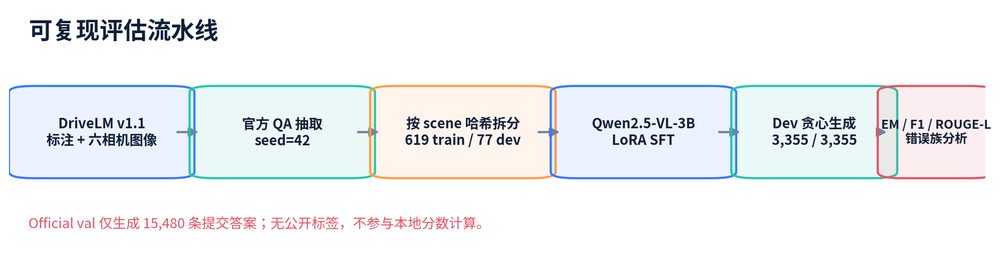

<div align="center">

# RadarMind-DriveLM

**A reproducible six-camera DriveLM pipeline for open-source vision-language driving research**

[](https://www.python.org/)
[](https://huggingface.co/Qwen/Qwen2.5-VL-3B-Instruct)
[](https://huggingface.co/datasets/OpenDriveLab/DriveLM)
[](https://github.com/1zhiCheng/radarmind-drivelm/actions)
[](LICENSE)

Single-frame six-view perception · Graph-VQA · Qwen2.5-VL · CE/DPO · adaptive Mixture of LoRA Experts · local DriveLM-DS evaluation

</div>

### Scene 1 · daytime urban driving

<p align="center">
  <a href="assets/video/RadarMind_DriveLM_continuous.mp4">
    
  </a>
</p>

### Scene 2 · wet night with a crossing pedestrian

<p align="center">
  <a href="assets/video/RadarMind_DriveLM_scene1094_continuous.mp4">
    
  </a>
</p>

<p align="center">
  Both inline animations cover the full 32-second scene; click either animation for the original 24 FPS MP4 ·
  <a href="reports/drivelm_reproduction_v1/drivelm_reproduction_technical_report.pdf">technical report</a>
</p>

## What this repository adds

The upstream DriveLM release provides data and challenge utilities, but not a complete modern open-weight VLM training path. This repository keeps the official DriveLM-nuScenes v1.1 question IDs, six-camera order and submission schema, and adds a runnable Qwen2.5-VL implementation:

- deterministic scene-isolated train/dev construction with leakage checks;
- six independent camera inputs in the fixed `front / front-left / front-right / back / back-left / back-right` order;
- assistant-token-only autoregressive cross-entropy LoRA SFT;
- task-balanced conservative DPO with a chosen-answer CE anchor;
- answer-independent hard routing across four task-specific LoRA experts;
- resumable checkpoint sweeps with validation-driven early stopping and automatic rollback;
- single-GPU baseline and multi-GPU `accelerate` training;
- resumable 3,355-QA inference with 100% coverage accounting;
- lexical evaluation plus a cached DeepSeek replacement for the unavailable GPT semantic judge;
- official-val JSON export and continuous DriveLM-style reasoning videos.

This is a modern equivalent reproduction, not a parameter-identical reproduction of the paper's unpublished BLIP-2 training stack.

## Pipeline

<p align="center">
  
</p>

```text
DriveLM-nuScenes v1.1 QA + six synchronized images
  -> official extraction and scene-isolated split
  -> Qwen2.5-VL + LoRA, assistant-only CE
  -> 3,355 local-dev predictions
  -> EM / Token-F1 / ROUGE-L / MC accuracy
  -> DriveLM-DS structural proxy
  -> official-val submission JSON
```

The active leaderboard path is camera-only and single-frame. Radar, LiDAR, map, CARLA labels, history frames and dev references are intentionally excluded.

## Results

### v0.36 controlled B00/B10/B11 comparison

All variants use the same 26,095 training QA, 3,355 scene-isolated dev QA, six-camera prompt, assistant-token-only CE objective, effective global batch size of 4, LoRA rank 8 and seed 42. B00 -> B10 changes only model capacity; B10 -> B11 changes only the visual budget.

| Variant | Base model | Visual budget / image | Train time | Coverage | Exact Match | Token-F1 | ROUGE-L | MC accuracy |
| --- | --- | ---: | ---: | ---: | ---: | ---: | ---: | ---: |
| B00 | Qwen2.5-VL-3B | 128 tokens | 3.03 h | 100% | 42.59% | 72.75% | 70.63% | 81.80% |
| **B10** | **Qwen2.5-VL-7B** | **128 tokens** | **3.13 h** | **100%** | **43.46%** | **73.00%** | **71.08%** | **83.82%** |
| B11 | Qwen2.5-VL-7B | 256 tokens | 5.50 h | 100% | 42.77% | 72.75% | 70.93% | 82.02% |

DriveLM-DS follows the public DriveLM metric structure and graph gating, replacing the unavailable GPT judge with deterministic, cached DeepSeek-V4-Flash calls. Every required semantic item completed successfully; these are local proxy scores, not hidden challenge-server scores.

| Variant | Graph eligible | Judge complete | Accuracy | Planning /100 | Language | Coordinate F1 | Graph /100 | Match /100 | Final |
| --- | ---: | ---: | ---: | ---: | ---: | ---: | ---: | ---: | ---: |
| B00 | 1,844 | 752/752 | 77.12% | 68.48 | 0.4683 | **13.38%** | **44.77** | **29.08** | 0.58000 |
| **B10** | **1,889** | **770/770** | **79.91%** | 70.63 | **0.4760** | 13.13% | 43.94 | 28.54 | **0.59464** |
| B11 | 1,779 | 723/723 | 75.55% | **70.68** | 0.4539 | 12.12% | 44.17 | 28.14 | 0.58088 |

B10 improves over B00 by **+0.86 percentage points EM**, **+2.02 points multiple-choice accuracy**, **+45 graph-eligible QA**, and **+0.01463 Final** (+2.52% relative). Doubling the B11 visual budget costs 75.5% more training time than B10 but lowers Final by 0.01376, so **B10 is the selected v0.36 checkpoint** and B11 is retained as a controlled negative result.

### v0.37A offline DPO

The complete train-only preference pipeline produced 7,149 leakage-free pairs from 26,095 B10 candidate records. Three-GPU DPO completed 596 steps, followed by a full checkpoint sweep.

| Variant | Exact Match | Token-F1 | ROUGE-L | MC accuracy | Planning /100 | Final |
| --- | ---: | ---: | ---: | ---: | ---: | ---: |
| **B10** | 43.46% | 73.00% | 71.08% | 83.82% | **70.63** | **0.59464** |
| DPO step 100 | **43.55%** | **73.17%** | **71.22%** | 84.27% | 69.75 | 0.59430 |
| DPO step 200 | 43.67% | 73.13% | 71.14% | 84.27% | 69.72 | 0.59196 |
| DPO step 300 | 43.49% | 73.12% | 71.02% | 83.93% | 66.42 | 0.57561 |
| DPO step 596 | 42.98% | 71.76% | 69.40% | **84.83%** | 66.52 | 0.55330 |

DPO improved multiple-choice accuracy but did not pass the Final and planning promotion gates. See the [full v0.37A report](docs/current/VERSION_0_37A_DRIVELM_B10_DPO.md).

### v0.37B task-balanced, CE-anchored DPO

v0.37B returned to the original B10 adapter, balanced the four DriveLM task families at 1,026 train-only preference pairs each, reduced `beta` and learning rate, and added a chosen-answer CE anchor. All four saved checkpoints were evaluated on all 3,355 dev QA before a frozen selector chose step 75. DeepSeek was called only for this selected candidate.

| Metric | B10 | **v0.37B step 75** | Delta |
| --- | ---: | ---: | ---: |
| Coverage | 100% | 100% | 0 |
| Exact Match | 43.4575% | **43.5768%** | +0.1193pp |
| Token-F1 | 73.0000% | **73.1231%** | +0.1232pp |
| ROUGE-L | 71.0756% | **71.2034%** | +0.1278pp |
| MC accuracy | 83.8202% | **84.1573%** | +0.3371pp |
| Planning /100 | 70.6348 | **70.8571** | +0.2223 |
| Coordinate F1 | 13.1313% | **13.3838%** | +0.2525pp |
| DriveLM-DS Final | 0.594636 | **0.596356** | +0.001721 |

The semantic judge completed **762/762** required items with zero failures. Because graph gating yielded 1,889 eligible QA for B10 and 1,866 for v0.37B, a second fairness audit evaluated both models on the exact same 1,807 eligible IDs. On this paired subset, Final still improves from **0.593546 to 0.594602**; both judges complete 732/732 cached items, while planning changes by -0.192 points, within the frozen -0.5 tolerance. Final, planning, coordinate, MC, coverage and judge-completeness gates therefore all pass, so **v0.37B step 75 is the current local-dev checkpoint**. The gain is deliberately reported as a controlled local result, not an official hidden-server score. See the [complete report](docs/current/VERSION_0_37B_DRIVELM_CONSERVATIVE_DPO.md), [reproduction guide](reproduction/qwen_vl_v037b/README.md) and [machine-readable results](results/v037b/).

### v0.38 grounding result and v0.38B direction

v0.38A increased eligible QA from **1,866 to 1,901** and anchor coordinate F1 from **14.07% to 14.83%**, but Planning fell from **70.86 to 69.73** and Final from **0.59636 to 0.59209**, so it was not promoted. A zero-training anchor-routing diagnostic retained the 1,901 eligible QA but obtained only **0.59215 Final**. The 35 newly eligible Planning QA average **52.0**, versus **70.76** on the common cohort, showing that downstream graph consumption—not anchor routing alone—is the next bottleneck.

v0.38B therefore uses strict scene-level out-of-fold graph memory and matched `G00`/`G10` pure-CE controls before any further preference optimization. See the [v0.38A result](docs/current/VERSION_0_38A_DRIVELM_GROUNDING_PREFERENCE.md), [v0.38B experiment contract](docs/current/VERSION_0_38B_DRIVELM_OOF_GRAPH_MEMORY.md), and compact [v0.38A](results/v038a/final_summary.json) / [v0.38B-0](results/v038b/anchor_route_summary.json) results.

### v0.39 adaptive Mixture of LoRA Experts

v0.39 replaces the failed graph-memory branch with four task-specific rank-8 LoRA adapters, hard-routed by the answer-independent official task key. A shared-LoRA control and a 100-step MoL pilot established feasibility. The v0.39B controller then evaluated every 100 steps, extended training only while the frozen Token-F1 criterion improved, and stopped after steps 800/900 both failed the `0.0005` minimum-delta rule.

| Metric | v0.39A | **v0.39B step 700** | Delta |
| --- | ---: | ---: | ---: |
| Coverage | 100% | 100% | 0 |
| Exact Match | 43.6066% | **43.9940%** | +0.3875pp |
| Token-F1 | 73.2612% | **74.5346%** | +1.2735pp |
| ROUGE-L | 71.3344% | **72.4050%** | +1.0706pp |
| MC accuracy | 84.2697% | **84.4944%** | +0.2247pp |
| Planning /100 | 70.7832 | **72.4769** | +1.6936 |
| Coordinate F1 | 13.3838% | **14.6465%** | +1.2626pp |
| Graph /100 | 44.9242 | **46.8561** | +1.9318 |
| Match /100 | 29.1540 | **30.7513** | +1.5972 |
| DriveLM-DS Final | 0.596955 | **0.608245** | **+0.011290** |

On the exact same 1,812 eligible IDs, Final improves from **0.593502 to 0.607388** and every paired gate passes. Step 700 is therefore frozen in `best_checkpoint.json` as the trajectory-RL initialization. See the [full v0.39 report](docs/current/VERSION_0_39_DRIVELM_ADAPTIVE_MOL.md), [reproduction scripts](reproduction/qwen_vl_v039_mol/) and [machine-readable summary](results/v039b/summary.json).

## Project status and TODO

Active route: single-frame six-camera DriveLM-nuScenes, with v0.39B MoL step 700 as the current local-dev checkpoint and v0.39A retained as the immediate frozen control.

- [x] Prepare the **26,095 train / 3,355 scene-isolated dev** dataset.
- [x] Complete B00/B10/B11 CE-LoRA training and evaluation.
- [x] Select **B10 (Qwen2.5-VL-7B)** as the best baseline: Final **0.59464**.
- [x] Implement and smoke-test three-RTX-5090 preference candidate generation.
- [x] Generate **26,095/26,095** candidates and construct 7,149 leakage-free preference pairs.
- [x] Precompute frozen-B10 reference log-probabilities with 100% pair coverage.
- [x] Train B10-DPO on three RTX 5090 GPUs and evaluate five intermediate checkpoints.
- [x] Complete 3,355-QA dev and DeepSeek evaluation; DPO did not pass the promotion gate.
- [x] Run v0.37B task-balanced, CE-anchored conservative DPO and sweep four checkpoints.
- [x] Promote **v0.37B step 75** after all frozen gates pass: Final **0.59636**.
- [x] Audit legacy graph/coordinate candidates and identify the 128-token truncation confound.
- [x] Build the leakage-free v0.38A 4,104-pair grounding/replay manifest from complete 256-token candidates.
- [x] Complete v0.38A three-GPU DPO and four-checkpoint evaluation; grounding improved, but Final **0.59209** failed promotion.
- [x] Run the v0.38B-0 anchor-routing diagnosis; newly eligible Planning QA average only **52.0**, so routing alone is insufficient.
- [x] Run the 35-QA oracle-memory probe: Planning **52.00 -> 54.86**, but only 2 answers changed.
- [x] Close the graph-memory branch after its feasibility evidence remained too weak for full OOF training.
- [x] Train shared-LoRA and four-expert MoL controls; confirm the MoL pilot passes full and same-ID gates.
- [x] Run adaptive v0.39B checkpoint search through step 900 and promote **step 700: Final 0.608245**.
- [ ] Train trajectory-policy controls from the frozen step-700 adapters and compare GRPO with GSPO under one reward/data budget.

### Earlier v0.31 reproduction baseline

The first Qwen2.5-VL-3B reproduction obtained 44.26% Exact Match, 73.33% Token-F1, 71.59% ROUGE-L and 81.46% multiple-choice accuracy with 100% coverage. It predates the controlled v0.36 protocol and is reported separately rather than ranked against B00/B10/B11. See [the complete v0.36 report](docs/current/VERSION_0_36_DRIVELM_CAMERA_ONLY_PURE_CE.md) for configurations, paths and failure analysis.

## Quick start

### 1. Environment

PyTorch must be installed separately for the CUDA version on your machine.

```bash
git clone git@github.com:1zhiCheng/radarmind-drivelm.git
cd radarmind-drivelm

conda create -n radarmind-drivelm python=3.11 -y
conda activate radarmind-drivelm
# Install a CUDA-compatible torch build first: https://pytorch.org/get-started/locally/
python -m pip install -r requirements.txt
```

Validated workstation configuration: Python 3.12, PyTorch 2.11, Transformers 5.5, PEFT 0.19. Earlier compatible versions are accepted by `requirements.txt`.

### 2. Download data and model

Never write a Hugging Face token into a script or commit it to Git.

```bash
hf auth login
mkdir -p downloads data models

hf download OpenDriveLab/DriveLM \
  drivelm_nus_imgs_train.zip drivelm_nus_imgs_val.zip \
  v1_1_train_nus.json v1_1_val_nus_q_only.json \
  --repo-type dataset --local-dir downloads

unzip -q downloads/drivelm_nus_imgs_train.zip -d data
unzip -q downloads/drivelm_nus_imgs_val.zip -d data
mkdir -p data/QA_dataset_nus
cp downloads/v1_1_*_nus*.json data/QA_dataset_nus/

hf download Qwen/Qwen2.5-VL-3B-Instruct \
  --local-dir models/Qwen2.5-VL-3B-Instruct
python scripts/check_setup.py
```

The audit must report `six_camera_dirs: 6` and `ready: true` before dataset construction.

### 3. Build the deterministic JSONL

```bash
python reproduction/qwen_vl/build_dataset.py \
  --train-json data/QA_dataset_nus/v1_1_train_nus.json \
  --val-json data/QA_dataset_nus/v1_1_val_nus_q_only.json \
  --output-dir data/reproduction/qwen_vl \
  --seed 42 --dev-ratio 0.1
```

Expected counts are 26,095 train QA and 3,355 scene-isolated dev QA. Image paths are resolved and verified during the build.

### 4. Dry-run before training

```bash
python reproduction/qwen_vl_v036/train_ddp.py \
  --model-path models/Qwen2.5-VL-3B-Instruct \
  --train-jsonl data/reproduction/qwen_vl/qwen_train.jsonl \
  --output-dir /tmp/radarmind-drivelm-dry-run \
  --max-train-samples 64 --max-pixels $((128*28*28)) --dry-run
```

The report must contain exactly six visual inputs per sample and at least one supervised assistant token.

### 5. Train

Single GPU:

```bash
CUDA_VISIBLE_DEVICES=0 python reproduction/qwen_vl/train.py \
  --model-path models/Qwen2.5-VL-3B-Instruct \
  --train-jsonl data/reproduction/qwen_vl/qwen_train.jsonl \
  --output-dir models/radarmind-drivelm-3b \
  --device cuda:0 --batch-size 1 --gradient-accumulation-steps 4 \
  --epochs 1 --learning-rate 2e-4 --save-steps 500
```

Two GPUs with the v0.36 pure-CE trainer:

```bash
CUDA_VISIBLE_DEVICES=0,1 accelerate launch --multi_gpu --num_processes 2 \
  reproduction/qwen_vl_v036/train_ddp.py \
  --experiment-name radarmind-drivelm-3b \
  --model-path models/Qwen2.5-VL-3B-Instruct \
  --train-jsonl data/reproduction/qwen_vl/qwen_train.jsonl \
  --output-dir models/radarmind-drivelm-3b-ddp \
  --per-device-batch-size 1 --gradient-accumulation-steps 2 \
  --epochs 1 --learning-rate 2e-4 --lora-rank 8 --lora-alpha 16 \
  --max-pixels $((128*28*28)) --max-length 4096 --save-steps 500
```

### 6. Infer and evaluate

```bash
python reproduction/qwen_vl/infer.py \
  --model-path models/Qwen2.5-VL-3B-Instruct \
  --adapter-path models/radarmind-drivelm-3b \
  --input-jsonl data/reproduction/qwen_vl/qwen_dev.jsonl \
  --output-json outputs/dev_predictions.json \
  --device cuda:0 --max-new-tokens 256 --resume

python reproduction/qwen_vl/evaluate_offline.py \
  --references-jsonl data/reproduction/qwen_vl/qwen_dev.jsonl \
  --predictions-json outputs/dev_predictions.json \
  --output-json outputs/dev_metrics.json
```

For DriveLM-DS, store the DeepSeek key outside the repository and restrict its permissions:

```bash
mkdir -p ~/.config/radarmind
printf '%s' "$DEEPSEEK_API_KEY" > ~/.config/radarmind/deepseek_api_key
chmod 600 ~/.config/radarmind/deepseek_api_key

python reproduction/drivelm_ds_eval/evaluate.py \
  --references-jsonl data/reproduction/qwen_vl/qwen_dev.jsonl \
  --predictions-json outputs/dev_predictions.json \
  --output-json outputs/drivelm_ds.json \
  --cache-file outputs/deepseek_judge.sqlite
```

DriveLM-DS preserves the public metric structure but substitutes a frozen DeepSeek semantic judge; report it only as a local proxy.

## Repository layout

```text
challenge/                    official DriveLM extraction and evaluation tools
reproduction/qwen_vl/        dataset, single-GPU SFT, inference and lexical eval
reproduction/qwen_vl_v036/   controlled pure-CE multi-GPU trainer
reproduction/qwen_vl_v037a/  candidate generation, preference audit and DPO
reproduction/qwen_vl_v039_mol/ hard-routed LoRA experts, adaptive early stopping and finalization
reproduction/qwen_vl_v037b/  balanced, CE-anchored conservative DPO and selection
reproduction/qwen_vl_v038/   graph-anchor/coordinate data audit and controlled post-training
reproduction/drivelm_ds_eval local structural/semantic proxy evaluator
docs/current/                 current experiment contracts and results
docs/demos/                   continuous-video reproduction notes
results/v039b/                compact v0.39B convergence, fairness and promotion summary
reports/                      illustrated Chinese technical report
results/v037b/                compact, machine-readable v0.37B experiment manifests
assets/                       preview images and full MP4 demos
```

## Limitations

- The local split is for reproducible model selection; official val has no public answers.
- The published results use visual key frames rather than raw temporal camera streams.
- Coordinate grounding and planning remain the main error sources.
- Model weights and datasets are intentionally not committed to this repository.

## Acknowledgement and citation

Built on [DriveLM](https://github.com/OpenDriveLab/DriveLM), [nuScenes](https://www.nuscenes.org/) and [Qwen2.5-VL](https://github.com/QwenLM/Qwen2.5-VL). Please cite the original projects when using their data, code or models. The upstream DriveLM citation is also available in [CITATION.cff](CITATION.cff).

## License

Code in this repository is released under [Apache-2.0](LICENSE). DriveLM data, nuScenes images and model weights retain their respective licenses and terms.
